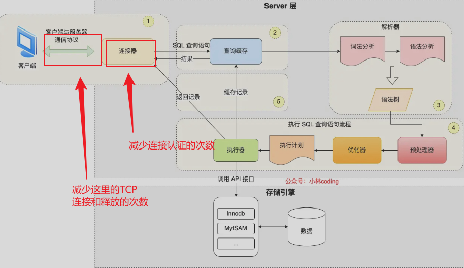

###关键技术点

`MySQL`数据库编程、单例模式、queue队列容器、C++11多线程编程、线程互斥、线程同步通信和unique_lock、基于`CAS`的原子整形、智能指针`shared_ptr`、`lambda`表达式、生产者-消费者线程模型

### 项目背景



为了提高`MySQL`数据库（基于C/S设计）的访问瓶颈，除了在服务器端增加缓存服务器缓存常用的数据之外（例如`redis`），还可以增加连接池，来提高`MySQL Server`的访问效率，在高并发情况下，(客户端和`mysql server`)大量的**TCP**三次握手、**`MySQL Server`**连接认证、**`MySQL Server`**关闭连接回收资源和**`TCP`**四次挥手所耗费的性能时间也是很明显的，==增加连接池就是为了减少这一部分的性能损耗。== 

###连接池功能点介绍

连接池一般包含了数据库连接所用的`ip`地址、`port`端口号、用户名和密码以及其它的性能参数，例如初始连接量，最大连接量，最大空闲时间、连接超时时间等，该项目是基于C++语言实现的连接池，主要也是实现以上几个所有连接池都支持的通用基础功能。


**初始连接量（`initSize`）**：表示连接池事先(在连接池构造函数中)会和`MySQLServer`创建`initSize`个数的`connection`连接，当应用发起`MySQL`访问时，不用再创建和`MySQL Server`新的连接，直接从连接池中获取一个可用的连接就可以，使用完成后，并不去释放`connection`，而是把当前`connection`再归还到连接池当中(根据`shared_ptr`可以自定义删除器的特性实现)。


**最大连接量（`maxSize`**）：当并发访问`MySQL Server`的请求增多时，初始连接量已经不够使用了，此时会根据新的请求数量去创建更多的连接给应用去使用，但是新创建的连接数量上限是`maxSize`，不能无限制的创建连接，因为每一个连接都会占用一个`socket`资源，一般连接池和服务器程序是部署在一台主机上的，如果连接池占用过多的`socket`资源，那么服务器就不能接收太多的客户端请求了。当这些连接使用完成后，再次归还到连接池当中来维护。


**最大空闲时间（`maxIdleTime`)**：当访问`MySQL`的并发请求多了以后，连接池里面的连接数量会动态增加，上限是`maxSize`个，当这些连接用完再次归还到连接池当中。如果在指定的`maxIdleTime`里面，这些新增加的连接都没有被再次使用过，那么新增加的这些连接资源就要被回收掉(这里需要创建一个回收线程，专门用来回收空闲线程)，只需要保持初始连接量`initSize`个连接就可以了。


**连接超时时间（`connectionTimeout`）**：当`MySQL`的并发请求量过大，连接池中的连接数量已经到达`maxSize`了，而此时没有空闲的连接可供使用，那么此时应用从连接池获取连接无法成功，它通过==阻塞==的方式获取连接的时间如果超过`connectionTimeout`时间，那么获取连接失败，无法访问数据库。


### `MySQL Server`参数介绍

```sql
mysql> show variables like 'max_connections';
```

该命令可以查看`MySQL Server`所支持的最大连接个数，超过`max_connections`数量的连接，`MySQL Server`会直接拒绝，所以在使用连接池增加连接数量的时候，`MySQL Server`的`max_connections`参数也要适当的进行调整(通过修改其配置文件)，以适配连接池的连接上限。


###功能实现设计

`ConnectionPool.cpp`和`ConnectionPool.h`：连接池代码实现

`Connection.cpp`和`Connection.h`：数据库操作代码、增删改查代码实现。

`test.cpp` : 对连接池进行测试的代码。


###连接池主要包含了以下功能点：

+ 连接池只需要一个实例，所以`ConnectionPool`以单例模式进行设计,为了确保线程安全，单例模式为懒汉式单例模式，通过局部静态对象实现。

+ 从`ConnectionPool`中可以获取和`MySQL`的连接`Connection`(取连接队列中的一个队头的连接)

+ 空闲连接`Connection`全部维护在一个线程安全的`Connection`队列中，使用==线程互斥锁==保证队列的线程安全

+ 如果`Connection`队列为空，还需要再获取连接，此时需要动态创建连接，上限数量是`maxSize`

+ 队列中空闲连接时间超过`maxIdleTime`的就要被释放掉，只保留初始的`initSize`个连接就可以了，需要放在独立的线程中去做

+ 如果`Connection`队列为空，而此时连接的数量已达上限`maxSize`，那么等待`connectionTimeout`时间如果还获取不到空闲的连接，那么获取连接失败，此处从`Connection`队列获取空闲连接，可以使用带超时时间的`mutex`互斥锁来实现连接超时时间

+ 用户获取的连接用`shared_ptr`智能指针来管理，用`lambda`表达式定制连接释放的功能（不真正释放连接，而是把连接归还到连接池中）

+ 连接的生产和连接的消费采用生产者-消费者线程模型来设计，使用了线程间的==同步通信机制条件变量==和互斥锁


