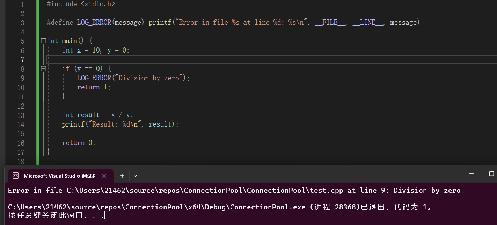

###在`VS 2022` 中进行配置操作

这里的`MySQL`数据库编程直接采用oracle公司提供的`MySQL C/C++`客户端开发包，在`VS`上需要进行相应的头文件和库文件的配置:

+ 右键项目 -` C/C++` - 常规 - 附加包含目录，填写`mysql.h`头文件的路径

+ 右键项目 - 链接器 - 常规 - 附加库目录，填写`libmysql.lib`的路径

+ 右键项目 - 链接器 - 输入 - 附加依赖项，填写`libmysql.lib`库的名字

+ 把`libmysql.dll`动态链接库（Linux下后缀名是.so库）放在工程目录下,在使用它的时候就回去当前目录下搜索`libmysql.dll`库了。

```C++
#include <mysql.h>
#include <string>
using namespace std;
#include "public.h"
// 数据库操作类
class MySQL
{
   public:
   // 初始化数据库连接
   MySQL()
   {
      _conn = mysql_init(nullptr);
   }
   // 释放数据库连接资源
   ~MySQL()
   {
      if (_conn != nullptr)
         mysql_close(_conn);
   }
   // 连接数据库
   bool connect(string ip, unsigned short port, string user, string password,
                string dbname)
   {
      MYSQL *p = mysql_real_connect(_conn, ip.c_str(), user.c_str(),
                                    password.c_str(), dbname.c_str(), port, nullptr, 0);
      return p != nullptr;
   }
   // 更新操作 insert、delete、update
   bool update(string sql)
   {
      if (mysql_query(_conn, sql.c_str()))
      {
         LOG("更新失败:" + sql);
         return false;
      }
      return true;
   }
   // 查询操作 select
   MYSQL_RES* query(string sql)
   {
      if (mysql_query(_conn, sql.c_str()))
      {
         LOG("查询失败:" + sql);
         return nullptr;
      }
      return mysql_use_result(_conn);
   }
   private:
   MYSQL *_conn; // 表示和MySQL Server的一条连接
};
```

`MYSQL` 类型和一系列的函数是在`mysql.h`头文件中声明的，其定义是在`C:\Program Files\MySQL\MySQL Server 8.0\lib` 文件夹下的`libmysql.dll` 和`libmysql.lib(有动态库的函数说明)` 和`mysqlclient.lib`中被封装成为动态库和静态库了，我们无法查看其源码。


如果想要在项目中`#include<mysql.h>`，需要配置项目属性，从而指示编译器能够找到这个头文件：【注意：我们需要使用的`mysql`的库是在64位版本的，需要配置项目的位数为64位，否则将会出现大量的==链接错误==,保证项目为`X64`即可】


`MYSQL`类型实际上是一个结构体，存储连接的信息的结构体：

```C++
// 位于mysql.h中的结构体的定义
typedef struct MYSQL {
  NET net;                     /* Communication parameters */
  unsigned char *connector_fd; /* ConnectorFd for SSL */
  char *host, *user, *passwd, *unix_socket, *server_version, *host_info;
  char *info, *db;
  struct CHARSET_INFO *charset;
  MYSQL_FIELD *fields;
  struct MEM_ROOT *field_alloc;
  uint64_t affected_rows;
  uint64_t insert_id;      /* id if insert on table with NEXTNR */
  uint64_t extra_info;     /* Not used */
  unsigned long thread_id; /* Id for connection in server */
  unsigned long packet_length;
  unsigned int port;
  unsigned long client_flag, server_capabilities;
  unsigned int protocol_version;
  unsigned int field_count;
  unsigned int server_status;
  unsigned int server_language;
  unsigned int warning_count;
  struct st_mysql_options options;
  enum mysql_status status;
  enum enum_resultset_metadata resultset_metadata;
  bool free_me;   /* If free in mysql_close */
  bool reconnect; /* set to 1 if automatic reconnect */

  /* session-wide random string */
  char scramble[SCRAMBLE_LENGTH + 1];

  LIST *stmts; /* list of all statements */
  const struct MYSQL_METHODS *methods;
  void *thd;
  /*
    Points to boolean flag in MYSQL_RES  or MYSQL_STMT. We set this flag
    from mysql_stmt_close if close had to cancel result set of this object.
  */
  bool *unbuffered_fetch_owner;
  void *extension;
} MYSQL;
```


内置常量介绍：

> `__FILE__` 是一个特殊的预定义宏，在C和C++编程中经常使用。它用于==获取当前源文件的文件名==，==通常与 `__LINE__` 配合使用==，以获得在源代码中的特定位置的行号。这些宏通常用于调试和日志记录。
>
> 在C和C++中，`__FILE__` 宏会在编译时被替换为包含当前源文件名的字符串字面值。例如，如果你在源文件 `myprogram.c` 中使用 `__FILE__` 宏，它将被替换为 `"myprogram.c"`。
>
> 以下是一个示例，演示如何在C语言中使用 `__FILE__` 和 `__LINE__` 宏来记录错误信息：
>
> ```C++
> #include <stdio.h>
> 
> #define LOG_ERROR(message) printf("Error in file %s at line %d: %s\n", __FILE__, __LINE__, message)
> 
> int main() {
>     int x = 10, y = 0;
>     
>     if (y == 0) {
>         LOG_ERROR("Division by zero");
>         return 1;
>     }
>     
>     int result = x / y;
>     printf("Result: %d\n", result);
>     
>     return 0;
> }
> 
> ```
>
> 在这个示例中，当除以零时，宏 `LOG_ERROR` 会打印出错误消息，包括文件名和行号。`__FILE__` 和 `__LINE__` 宏是在编译时由编译器替换的，以提供关于错误发生位置的信息，这对于调试非常有用。
>
> 请注意，`__FILE__` 宏通常会包含文件的完整路径，具体格式取决于编译器和操作系统。
>
> 


### 对数据库连接进行测试

`connection.h`

```c++
#pragma once

#include <mysql.h>
#include <string>
#include <iostream> 
#include "public.h"

using namespace std ; 


class Connection
{
public:
    // 初始化数据库连接
    Connection() ;  

    // 释放数据库连接资源
    ~Connection() ;  
    // 连接数据库
    bool connect(string ip, unsigned short port, string user, string password, string dbname ) ;  
   
    // 更新操作 insert、delete、update
    bool update(string sql); 
    
    // 查询操作 select
    MYSQL_RES* query(string sql) ;   
private:
    MYSQL* _conn; // 表示和MySQL Server的一条连接
};
```

`connection.cpp`

```C++
#include "Connection.h"

Connection::Connection()
{
    _conn = mysql_init(nullptr);   // 对结构体进行初始化
}
Connection::~Connection()
{
    if (_conn != nullptr)
        mysql_close(_conn);
}

bool Connection::connect(string ip, unsigned short port, string user, string password , string dbname)
{
    //如果连接成功，返回MYSQL*连接句柄。如果连接失败，返回NULL。对于成功的连接，返回值与第1个参数的值相同。
    MYSQL* p = mysql_real_connect(_conn, ip.c_str(), user.c_str(),
        password.c_str(), dbname.c_str(), port, nullptr, 0);
    return p != nullptr;
}


bool Connection::update(string sql)
{
    if (mysql_query(_conn, sql.c_str()))
    {
        LOG("更新失败:" + sql);
        return false;
    }
    return true;
}

MYSQL_RES* Connection::query(string sql)
{
    if (mysql_query(_conn, sql.c_str()))
    {
        LOG("查询失败:" + sql) ; 
        return nullptr;
    }
    return mysql_use_result(_conn);
}

```


`test.cpp`

```C++
#include <iostream>
#include "Connection.h"
using namespace std; 
int main()
{
	// 对数据库连接进行测试
	Connection conn  ; 
	char sql[1024] = { 0 }; 
	sprintf(sql, "insert into user(name , age , sex) values('%s' , %d , '%s' ) ",
		"zhang san" , 20 , "male" 
		) ; 
	conn.connect("127.0.0.1", 3306, "root", "123456", "chat");
	
	conn.update(sql) ;  

	return 0 ;  
}
```


连接成功！

