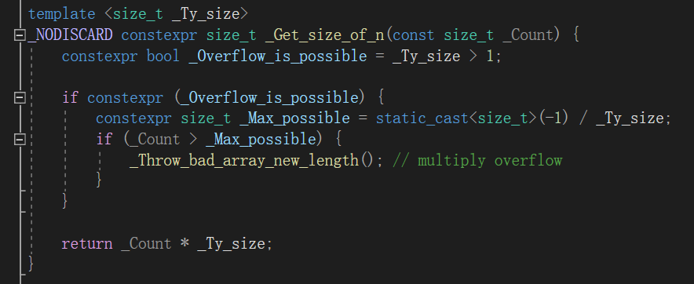
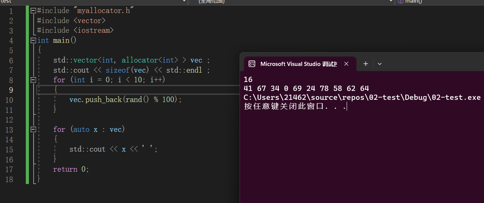

`allocator` 在`vector`中的调用形式、


`allocator.h`

```C++

#include <utility>
#include <mutex> 
#include <cstring>
#include <exception>
/*
	移植SGI STL 二级空间配置器的源码 ， 模版实现，
	并且实现的空间配置器是线程安全的 ， 容器产生的对象会在多个线程中去访问，所以需要保证空间配置器是线程安全的

	ngx 内存池中，对于每一个线程都会开辟一个内存池，不存在共享资源的情况，不用考虑线程安全的问题

*/


template <int __inst>
class __malloc_alloc_template {

private:

	static void* _S_oom_malloc(size_t);
	static void* _S_oom_realloc(void*, size_t);

	static void (*__malloc_alloc_oom_handler)();

public:

	static void* allocate(size_t __n)
	{
		void* __result = malloc(__n);
		if (0 == __result) __result = _S_oom_malloc(__n);
		return __result;
	}

	static void deallocate(void* __p, size_t /* __n */)
	{
		free(__p);
	}

	static void* reallocate(void* __p, size_t /* old_sz */, size_t __new_sz)
	{
		void* __result = realloc(__p, __new_sz);
		if (0 == __result) __result = _S_oom_realloc(__p, __new_sz);
		return __result;
	}

	static void (*__set_malloc_handler(void (*__f)()))()
	{
		void (*__old)() = __malloc_alloc_oom_handler;
		__malloc_alloc_oom_handler = __f;
		return(__old);
	}

};

template <int __inst>
void (*__malloc_alloc_template<__inst>::__malloc_alloc_oom_handler)() = 0;


template <int __inst>
void*
__malloc_alloc_template<__inst>::_S_oom_malloc(size_t __n)
{
	void (*__my_malloc_handler)();
	void* __result;

	for (;;) {
		__my_malloc_handler = __malloc_alloc_oom_handler;
		if (0 == __my_malloc_handler) { throw std::bad_alloc(); }
		(*__my_malloc_handler)();
		__result = malloc(__n);
		if (__result) return(__result);
	}
}

template <int __inst>
void* __malloc_alloc_template<__inst>::_S_oom_realloc(void* __p, size_t __n)
{
	void (*__my_malloc_handler)();
	void* __result;

	for (;;) {
		__my_malloc_handler = __malloc_alloc_oom_handler;
		if (0 == __my_malloc_handler) { throw std::bad_alloc(); }
		(*__my_malloc_handler)();
		__result = realloc(__p, __n);
		if (__result) return(__result);
	}
}

typedef __malloc_alloc_template<0> malloc_alloc;


template<typename T >
class allocator {
public:
	// 分配内存
	using value_type = T;

	constexpr allocator() noexcept {}

	constexpr allocator(const allocator&) noexcept = default;
	template <class _Other>
	constexpr allocator(const allocator<_Other>&) noexcept {}

	T* allocate(size_t __n)
	{
		__n = __n * sizeof(T) ;   // VS编译器在分配内存的时候，传递给allocate的参数是元素的个数，不是字节数 
		void* __ret = 0 ; 

		if (__n > (size_t)_MAX_BYTES) {
			__ret = malloc_alloc::allocate(__n);
		}
		else {
			// 防止线程缓存
			_Obj* volatile* __my_free_list
				= _S_free_list + _S_freelist_index(__n);


			// 出作用域自动析构
			std::lock_guard<std::mutex> guard(mtx);
			_Obj* __result = *__my_free_list;
			if (__result == 0)
				__ret = _S_refill(_S_round_up(__n));
			else {
				*__my_free_list = __result->_M_free_list_link;
				__ret = __result;
			}
		}

		return (T*)__ret;
	}

	// 释放内存
	void deallocate(void* __p, size_t __n)
	{
		if (__n > (size_t)_MAX_BYTES)
			malloc_alloc::deallocate(__p, __n);
		else {
			_Obj* volatile* __my_free_list
				= _S_free_list + _S_freelist_index(__n);
			_Obj* __q = (_Obj*)__p;

			// acquire lock
			std::lock_guard<std::mutex> guard(mtx);
			__q->_M_free_list_link = *__my_free_list;
			*__my_free_list = __q;
			// lock is released here
		}
	}


	// 内存扩容&缩容
	void* reallocate(void* __p, size_t __old_sz, size_t __new_sz)
	{
		void* __result;
		size_t __copy_sz;

		if (__old_sz > (size_t)_MAX_BYTES && __new_sz > (size_t)_MAX_BYTES) {
			return(realloc(__p, __new_sz));
		}
		if (_S_round_up(__old_sz) == _S_round_up(__new_sz)) return(__p);
		__result = allocate(__new_sz);
		__copy_sz = __new_sz > __old_sz ? __old_sz : __new_sz;
		memcpy(__result, __p, __copy_sz);
		deallocate(__p, __old_sz);
		return(__result);
	}

	// 对象构造

	template<typename Ty >
	void construct(T* __p, Ty&& val)
	{
		new (__p)T(std::forward<Ty>(val));
	}


	// 对象析构
	void destroy(T* __p)
	{
		__p->~T();
	}

private:
	enum { _ALIGN = 8 };
	enum { _MAX_BYTES = 128 };
	enum { _NFREELISTS = 16 }; // _MAX_BYTES/_ALIGN

	union _Obj {
		union _Obj* _M_free_list_link;
		char _M_client_data[1];    /* The client sees this.        */
	};

	// freelist链表定义
	static _Obj* volatile _S_free_list[_NFREELISTS];

	static char* _S_start_free;
	static char* _S_end_free;
	static size_t _S_heap_size;

	// 定义一把静态锁 , 内存池基于freelist实现，需要考虑线程安全，这里做线程互斥操作(需要再类外定义)
	static std::mutex mtx;


	// 辅助函数，访问权限为private
	static size_t _S_round_up(size_t __bytes)
	{
		return (((__bytes)+(size_t)_ALIGN - 1) & ~((size_t)_ALIGN - 1));
	}

	static size_t _S_freelist_index(size_t __bytes) {
		return (((__bytes)+(size_t)_ALIGN - 1) / (size_t)_ALIGN - 1);
	}

	static void* _S_refill(size_t __n)
	{
		int __nobjs = 20;
		char* __chunk = _S_chunk_alloc(__n, __nobjs);
		_Obj* volatile* __my_free_list;
		_Obj* __result;
		_Obj* __current_obj;
		_Obj* __next_obj;
		int __i;

		if (1 == __nobjs) return(__chunk);
		__my_free_list = _S_free_list + _S_freelist_index(__n);

		/* Build free list in chunk */
		__result = (_Obj*)__chunk;
		*__my_free_list = __next_obj = (_Obj*)(__chunk + __n);
		for (__i = 1; ; __i++) {
			__current_obj = __next_obj;
			__next_obj = (_Obj*)((char*)__next_obj + __n);
			if (__nobjs - 1 == __i) {
				__current_obj->_M_free_list_link = 0;
				break;
			}
			else {
				__current_obj->_M_free_list_link = __next_obj;
			}
		}
		return(__result);
	}

	static char* _S_chunk_alloc(size_t __size, int& __nobjs)
	{
		char* __result;
		size_t __total_bytes = __size * __nobjs;
		size_t __bytes_left = _S_end_free - _S_start_free;

		if (__bytes_left >= __total_bytes) {
			__result = _S_start_free;
			_S_start_free += __total_bytes;
			return(__result);
		}
		else if (__bytes_left >= __size) {
			__nobjs = (int)(__bytes_left / __size);
			__total_bytes = __size * __nobjs;
			__result = _S_start_free;
			_S_start_free += __total_bytes;
			return(__result);
		}
		else {
			size_t __bytes_to_get =
				2 * __total_bytes + _S_round_up(_S_heap_size >> 4);
			// Try to make use of the left-over piece.
			if (__bytes_left > 0) {
				_Obj* volatile* __my_free_list =
					_S_free_list + _S_freelist_index(__bytes_left);

				((_Obj*)_S_start_free)->_M_free_list_link = *__my_free_list;
				*__my_free_list = (_Obj*)_S_start_free;
			}
			_S_start_free = (char*)malloc(__bytes_to_get);
			if (nullptr == _S_start_free) {
				size_t __i;
				_Obj* volatile* __my_free_list;
				_Obj* __p;
				// Try to make do with what we have.  That can't
				// hurt.  We do not try smaller requests, since that tends
				// to result in disaster on multi-process machines.
				for (__i = __size;
					__i <= (size_t)_MAX_BYTES;
					__i += (size_t)_ALIGN) {
					__my_free_list = _S_free_list + _S_freelist_index(__i);
					__p = *__my_free_list;
					if (0 != __p) {
						*__my_free_list = __p->_M_free_list_link;
						_S_start_free = (char*)__p;
						_S_end_free = _S_start_free + __i;
						return(_S_chunk_alloc(__size, __nobjs));
						// Any leftover piece will eventually make it to the
						// right free list.
					}
				}
				_S_end_free = 0;	// In case of exception.
				_S_start_free = (char*)malloc_alloc::allocate(__bytes_to_get);
				// This should either throw an
				// exception or remedy the situation.  Thus we assume it
				// succeeded.
			}
			_S_heap_size += __bytes_to_get;
			_S_end_free = _S_start_free + __bytes_to_get;
			return(_S_chunk_alloc(__size, __nobjs));
		}
	}

};

// 初始化链表
template<typename T>
typename allocator<T>::_Obj* volatile allocator<T>::_S_free_list[_NFREELISTS] = {
	nullptr, nullptr, nullptr, nullptr,nullptr,nullptr,nullptr,nullptr,nullptr,nullptr,nullptr,nullptr,nullptr,nullptr,nullptr,nullptr
};

template<typename T>
char* allocator<T>::_S_start_free = nullptr;

template<typename T>
char* allocator<T>::_S_end_free = nullptr;

template<typename T>
size_t allocator<T>::_S_heap_size = 0;

// 静态锁的定义
template<typename T>
std::mutex allocator<T>::mtx;


```


==注意在`VS`编译器下的传递给`allocate()`函数的是元素的个数，在其内部的空间配置器内，需要乘上一个`sizeof(T)`== ， 所以在`windows`下，的`allocator`模版类中的`alloate()`函数的参数`__n`需要乘上`sizeof(T)`:

```c++
// 上述代码中的部分代码
T* allocate(size_t __n)
	{
		__n = __n * sizeof(T) ;   // VS编译器在分配内存的时候，传递给allocate的参数是元素的个数，不是字节数 
		void* __ret = 0 ; 
} 
```





==在`gnu`编译器中，传递给`allocate()`函数的`__n`的大小是字节数，而不是元素个数，可以通过`vscode`的调试功能验证==


`test.cpp`

```C++
#include "myallocator.h"
#include <vector>
#include <iostream>
int main()
{
	std::vector<int, allocator<int> > vec;
	for (int i = 0; i < 100; i++)
	{
		vec.push_back(rand() % 100);
	}

	for (auto x : vec)
	{
		std::cout << x << ' ';
	}
	return 0;
}
```




