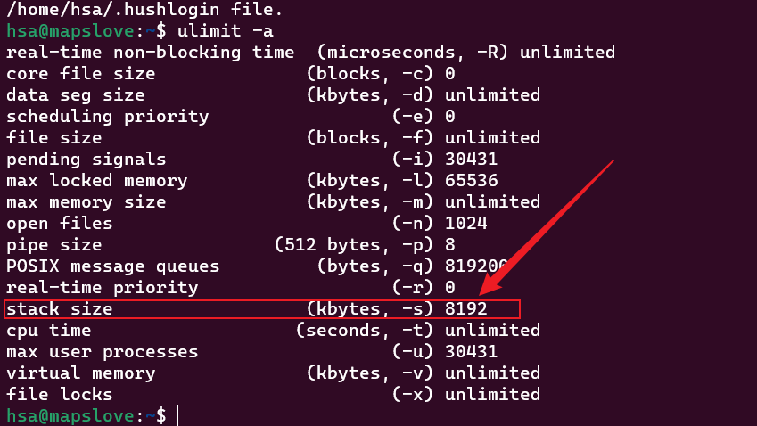
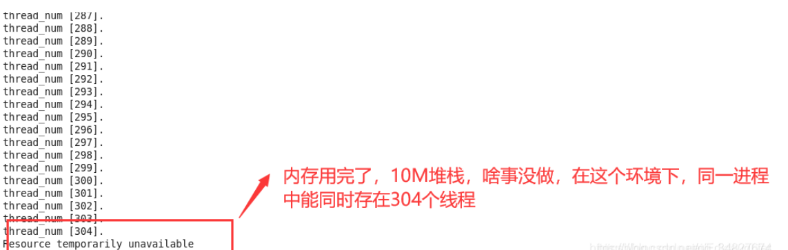
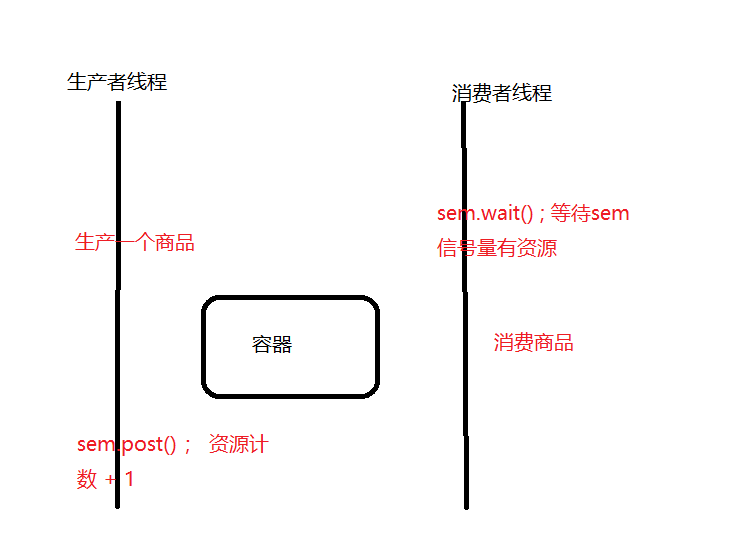

### 多线程的优势

***

多线程一定好吗？ 我们要看具体的应用场景：

 程序分为两种：

+ `IO`密集型
+ `CPU`密集型

> IO密集型（IO-bound）任务：指的是任务的**主要瓶颈是输入输出（IO）操作**，而不是计算操作。这种任务通常涉及大量的**文件读写、网络请求、数据库访问等IO操作**。在这种情况下，**CPU通常会处于等待IO完成的状态**，这个时候程序就被阻塞了，**因为IO操作相对较慢**。
>
> CPU密集型（CPU-bound）任务：指的是任务的**主要瓶颈是计算操作，而不是IO操作**。这种任务通常包括大规模的数据处理、复杂的算法计算、图像处理等需要大量CPU计算资源的操作。在这种情况下，CPU的计算能力成为任务的瓶颈，IO操作相对较快。

电脑为两种：

+ `CPU`单核
+ `CPU`多核、多CPU 

> 


一共有四种搭配情况，我们需要辨别的是每一种情况是否可以将**程序写为多核**的：

+ `IO ` 密集型程序在`多核，多CPU` 上：

  > 在此种情况下，我们将程序实现为`多线程`是合适的，假如有三个线程，当一个正在执行的线程因为`IO` 操作而被阻塞，操作系统会将其放入**阻塞队列**，不必像单线程一样等待其`IO` 操作，我们可以从**就绪队列中** 取出一个任务直接执行，从而提高了运行的效率。

+ `IO`密集型程序在`单核CPU` 上：

  > 也是合适的，程序是多线程的，当一个正在执行的线程因为`IO` 操作而被阻塞，操作系统会将其放入**阻塞队列**，不必像单线程一样等待其`IO` 操作，我们可以从**就绪队列中** 取出一个任务直接执行，从而提高了运行的效率。

+ `CPU`密集型程序在`多核，多CPU` 上：

  > 在此种情况下，我们将程序实现为`多线程`是比较好的 . 多个线程可以分配给多个处理单元分别进行处理，能够释放出`CPU`的硬件的计算能力。

+ `CPU`密集型程序在`单核CPU` 上：

  > ==不适合==，一个程序的计算量是定值，如果是单线程的话，就会一直执行，不会有什么额外的损耗，如果是`多线程`的话相当于将计算量分给多个线程，在**一个CPU** 上会来回切换线程。多线程会比单线程多一个**切换线程的开销** ， 所以：==如果是`CPU`密集型程序并且在`单核CPU`的情况下，我们最好还是将其设计为单线程的！==
  >
  > >线程调度的花费 ==线程的上下文切换==：当前线程调度完了，该调度下一个线程了。
  > >
  > >假设有三个线程`x, y , z`： 在`x`线程执行了一段时间之后，时间片到，切换到`y`线程 , 在切换之前，**先将CPU寄存器保存到`x`线程的栈上**【保存现场】 ， 将`y` 线程的栈上的`CPU` 信息恢复到`CPU` 寄存器中【恢复现场】，继续往下计算。
  > >
  > >线程调度的花费主要是**保存现场**和**恢复现场**


###**线程池**

####**线程的消耗**

为了完成任务，创建很多的线程可以吗？线程真的是越多越好？

线程的创建和销毁都是非常"重"的操作

> 创建线程所带来的消耗：
>
> + 空间的切换：从用户态切换到内核态。
> + 创建线程的`PCB`(`process control block`)块(相当于人的身份证) 
> + 为线程分配内核栈；
> + 为线程分配页目录/页表
> + 创建描述地址空间相应的数据结构(其地址入口存储于`PCB`结构体中的一个`vm_area_struct` 结构体中)
> + 从内核空间切换到用户空间。

线程栈本身占用大量内存

> ==进程内的所有线程共享进行的地址空间==，每开辟一个线程，必须为每一个线程分配固定大小的地址空间：
>
> 在`WSL2`中，默认的分配的栈空间的大小是`8M`：
>
> 
>
> **用户的地址空间可用的大小约为`3G`,一个进程最多分配`3G / 8M = 384 `个进程(实际个数一定比384的个数少，大约为300个)**  
>
> **验证代码：**
>
> ```C++
> #include <stdio.h>
> #include <pthread.h>
> #include <errno.h>
> #include <string.h>
> #include <ctime>
> #include <unistd.h>
> void *thread(void *vargp)
> {
>    while(1){
>       sleep(1) ;
>    }
> }
> 
> int main()
> {
>    int err = 0 , count = 0 ;
>    pthread_t tid ;
>    while(err == 0)
>    {
>       err = pthread_create(&tid , NULL , thread , NULL) ;
>       count ++ ;
>       printf("count = %d\n" , count ) ;
>    }
>    printf("create thread error : %s \n" , strerror(errno)) ;
>    printf("Maximum number of thread within a Process is : %d\n" , count ) ;
> 
>    getchar() ;
>    return 0 ;
> 
> }
> ```
>
> [代码源地址]([被问懵了：一个进程最多可以创建多少个线程？ - 小林coding - 博客园 (cnblogs.com)](https://www.cnblogs.com/xiaolincoding/p/15013929.html))   
>
> 
>
> **扩展:**
>
> 按 64 位系统的虚拟内存大小，理论上可以创建无数个线程。
>
> 事实上，肯定创建不了那么多线程，除了虚拟内存的限制，还有系统的限制。
>
> 比如下面这三个内核参数的大小，都会影响创建线程的上限：
>
> - `/proc/sys/kernel/threads-max`，表示系统支持的最大线程数，默认值是 `60863`(`WSL2`)；
> - `/proc/sys/kernel/pid_max`，表示系统全局的 `PID`号数值的限制，每一个进程或线程都有 `ID`，`ID` 的值超过这个数，进程或线程就会创建失败，默认值是 `4194304`；
> - `/proc/sys/vm/max_map_count`，表示限制一个进程可以拥有的`VMA`(虚拟内存区域)的数量，具体什么意思我也没搞清楚，反正如果它的值很小，也会导致创建线程失败，默认值是 `65530`
>
> **总结：** ==创建了一大批线程，还没有做任何业务，每一个线程都需要线程栈，栈几乎都被占用完了，无法做业务！== ， 所以线程的数量不宜过多。

线程的上下文切换要占用大量时间

> 线程过多，线程的调度需要进行上下文切换，上下文切换，花费的`CPU`的时间也特别多，`CPU`的利用率也就比较低了。

大量线程同时唤醒会使系统经常出现锯齿状负载或者瞬间负载量很大导致宕机

> 如果很多个线程在等待同一个条件，如果条件满足了，一瞬间，很多线程会被唤醒，此时，负载量会非常巨大，可能会导致死机！

**多少个线程比较好：** ==一般都是按照当前`CPU`的核心数量来确定的！== 

> ```markdown
> C++ 的  muduo 和 libevent 网络库 
> Java 的 Netty 和 mina 网络库
> Golang和Rust 的网络库
> 都是基于 I/O复用 + 多线程来实现的
> ```


##**线程池的优势**

操作系统上创建线程和销毁线程都是很"重"的操作，耗时耗性能都比较多，那么在服务执行的过程中，

如果业务量比较大，实时的去创建线程、执行业务、业务完成后销毁线程，那么会导致系统的实时性能

降低，业务的处理能力也会降低。

线程池的优势就是（每个池都有自己的优势），在服务进程启动之初，就事先创建好线程池里面的线

程，当业务流量到来时需要分配线程，直接从线程池中获取一个空闲线程执行`task`任务即可，`task`执行

完成后，也不用释放线程，而是把线程归还到线程池中继续给后续的`task`提供服务。

**`fixed`模式线程池**

线程池里面的线程个数是固定不变的，一般是`ThreadPool`创建时根据当前机器的CPU核心数量进行指

定。

**`cached`模式线程池**

线程池里面的线程个数是可动态增长的，根据任务的数量动态的增加线程的数量，但是会设置一个线程

数量的阈值(线程过多的坏处上面已经讲过了)，任务处理完成，如果动态增长的线程空闲了`60s`还没

有处理其它任务，那么关闭线程，保持池中最初数量的线程即可。


## **线程通信之信号量：`semaphore`**

应用场景：解决线程之间的同步通信

`mutex`互斥锁可以看为一种==资源计数==其值为`{0,1}`, 可以将`semaphore` 信号量看作资源计数没有限制的`mutex` 互斥锁。

```c++
semaphore sem(10) ; // 资源计数，初始值为10 

sem.wait() ; // 等待sem信号量有资源

sem.post() ; // 资源计数 + 1
```



==利用信号量实现：生产者和消费者之间的线程同步==

`semaphore` 信号量允许同一代码段可以被多线程同时执行，只要资源计数的值设置得当。


`semaphore sem(1) ` 二元信号量，在使用的时候其作用可以和`mutex` 同样的线程互斥操作； 但又有一些区别:

+ `mutex` 只能是由哪个线程获取锁，哪个线程释放锁。
+ `semaphore` 不同，`sem.wait() ` 和`sem.post()` 可以处在不同的线程中调用。


操作系统中的`P V ` 操作就相当于是`semaphore` 信号量中的`sem.wait() ` 和`sem.post()`

 


