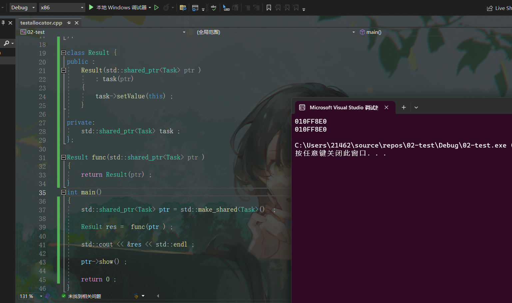
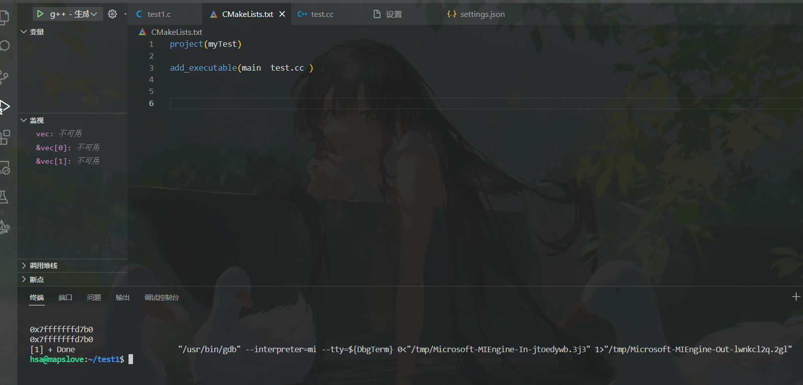

+ 编译器对于返回临时对象的优化的测试

  > 如果函数返回的是临时构造的对象，编译器会将这个临时对象优化掉，在调用方的接收处直接调用构造函数
  >
  > ==如果编译器进行了优化，则输出的两个地址是相同的==
  >
  > 测试代码：
  >
  > ```c++
  > #include <iostream>
  > #include <thread>
  > #include <memory> 
  > class Result ;  
  > class Task {
  > public: 
  > 	void setValue(Result* res)
  > 	{
  > 		result = res ;  
  > 	}
  > 	void show()
  > 	{
  > 		std::cout << result << std::endl ;  
  > 	}
  > private:
  > 	Result* result  ; 
  > };
  > 
  > class Result {
  > public : 
  > 	Result(std::shared_ptr<Task> ptr )
  > 		: task(ptr)
  > 	{
  > 		task->setValue(this) ;  
  > 	}
  > 
  > private:
  > 	std::shared_ptr<Task> task ; 
  > };
  > 
  > Result func(std::shared_ptr<Task> ptr )
  > {
  > 	return Result(ptr) ;  
  > }
  > int main()
  > {	
  > 	std::shared_ptr<Task> ptr = std::make_shared<Task>()  ; 
  >   	Result res =  func(ptr ) ;  
  > 	std::cout << &res << std::endl ; 
  > 	ptr->show() ;  
  > 
  > 	return 0 ;   
  > }
  > ```
  >
  > `windows VS 2022 `测试结果：
  >
  > 
  >
  > `linux g++ 11.4.0`  测试结果：
  >
  > ​	


+ `ThreadPool` 对象在析构的时候，无法正确回收线程，导致`mutex` 处于`busy` 状态的时候引发中断，导致程序异常

  > 重点看代码中如何实现在析构之前将所有的`mutex` 处于一个空闲状态。

+ 在析构时，我们的`main`线程和`ThreadPool` 线程池中的线程的死锁问题，的解决方式(线程池资源回收的策略)

  > 方案一
  >
  > ```c++
  > // ~ThreadPool() 的内容
  > // ~ThreadPool() 的内容
  > std::unique_lock<std::mutex> lock(taskQueMtx_) ;
  > exitCond_.wait(lock, [this]() -> bool {return taskCnt_ == 0; } ) ; 
  > PoolIsRuning_ = false ; 
  > // 等待所有的线程结束。
  > while (threadCnt_ > 0)
  > {
  > 	notEmpty_.notify_all() ; 
  > 	exitCond_.wait(lock);  // 等待每个线程被回收之后的一个notify_all() 从而当最后一个线程被结束的时候此处能够继续执行。
  > }
  > 
  > // ThreadFunc() 内容
  > auto lastTime = std::chrono::high_resolution_clock().now();
  > 
  > std::shared_ptr<Task> task;
  > for (; ; )  // 死循环进行任务的消费
  > {
  > 	// 加上一块作用域可以实现多个线程同时执行各自获得的任务
  > 	{
  > 		std::unique_lock<std::mutex> lock(taskQueMtx_);
  > 		std::cout << "tid: " << std::this_thread::get_id() << "尝试获取任务" << std::endl;
  > 		// 判断是否需要回收当前线程
  > 		while (taskCnt_ == 0)
  > 		{
  > 			if (!PoolIsRuning_ ) 
  > 			{
  > 				curIdleThread_--; // 空闲线程数量也被修改
  > 				threadCnt_--;  // 线程数量被修改。 
  > 				// 将线程对象从线程列表容器中删除 , 成功删除了线程列表
  > 				threadQue_.erase(threadId);
  > 				std::cout << "thread id: " << std::this_thread::get_id() << "线程池析构，线程结束" << std::endl;
  > 				exitCond_.notify_all();
  > 				return;
  > 			}
  > 			if (poolMode_ == PoolMode::MODE_CACHED)
  > 			{
  > 				if (std::cv_status::timeout ==
  > 					notEmpty_.wait_for(lock, std::chrono::seconds(1)))
  > 				{
  > 					auto now = std::chrono::high_resolution_clock().now();
  > 					auto dur = std::chrono::duration_cast<std::chrono::seconds>(now - lastTime);
  > 
  > 					if (dur.count() >= THREAD_MAX_IDLE_TIME && threadCnt_ > initThreadSize_) // 如果空闲的时间大于等于60秒。
  > 					{
  > 						// 相关变量的值的修改
  > 						curIdleThread_--; // 空闲线程数量也被修改
  > 						threadCnt_--;  // 线程数量被修改。 
  > 						// 将线程对象从线程列表容器中删除 , 成功删除了线程列表
  > 						threadQue_.erase(threadId);
  > 						std::cout << "thread id: " << std::this_thread::get_id() << "线程空闲时间太久，直接结束" << std::endl;
  > 						return;
  > 					}
  > 				}
  > 			}
  > 			else { // fixed 模式
  > 				// 如果线程池中没有任务的话，就一直阻塞当前线程，
  > 				notEmpty_.wait(lock);
  > 			}
  > 		}
  > 		std::cout << "获取任务成功" << std::endl;
  > 		task = taskQue_.front();
  > 		taskQue_.pop();
  > 		taskCnt_--;  // 任务数量减少 
  > 		curIdleThread_--;  // 空闲线程的数量减少 
  > 
  > 		// 通知消费者消费任务
  > 		if (taskCnt_ > 0) notEmpty_.notify_all();
  > 
  > 		// 通知生产者提交任务
  > 		notFull_.notify_all();
  > 	} // 在执行任务的时候，将锁提前进行释放 ， 出了右括号，锁就被释放了
  > 
  > 	if (task != nullptr)
  > 	{
  > 		task->exec();
  > 	}
  > 	// 更新线程开始空闲的时间戳
  > 	lastTime = std::chrono::high_resolution_clock().now();
  > 	curIdleThread_++; // 执行完毕之后，线程的数量进行增加
  > 	// 每执行完一次任务就尝试通知一下exitCond_ 上的等待线程，从而保证在析构的时候不会出问题。
  > 	exitCond_.notify_all();
  > 
  > }//在出这个右括号的时候，当前执行的这个 task 对象就会被析构掉，所以需要采用 Result(task)  而不是task(Result) ,采用Result(task) 之后，task 的生命周期会延迟到 Result 对象结束的时候。
  > 
  > ```
  >
  > 方案一中的核心思想：
  >
  > > 在析构函数中存在两个阻塞点：第一个，如果任务数量不为0，则在第一个`exitCond_.wait(lock)`,一直进行等待，==在`ThreadFunc`中，任何一个线程在执行完任务之后都会`exitCond_notify_all()`，如果是最后一个任务并且析构函数线程等待在`exitCond_.wait()`上，则析构线程继续向下执行，先将`PoolIsRuning = false`== ,之后到第二个阻塞点:如果`threadTask > 0 ` 就一直进行`exitCond_.wait()`  ，此时，无论线程池中的所有线程处于**任务执行状态** ， **等待状态** ， **抢占锁的状态** ， 最终都会进入**`notEmpty_()`等待状态**，如果`threadTask > 0 ` 析构线程也会`notEmpty_.notify_all()` ，通知处于**`notEmpty_()`等待状态** , ==最终通过一个一个线程的回收，达到线程池整体资源的回收！==
  >
  > 方案二
  >
  > ```c++
  > // ~ThreadPool()的内容***************************************************************
  > PoolIsRuning_ = false;
  > 
  > std::unique_lock<std::mutex> lock(taskQueMtx_);
  > // 等待所有的线程结束。
  > notEmpty_.notify_all() ; 
  > 
  > exitCond_.wait(lock, [this]() -> bool { return threadCnt_ == 0 ; } ) ;  // 等待每个线程被回收之后的一个notify_all() 从而当最后一个线程被结束的时候此处能够继续执行
  > 
  > 
  > // ThreadFunc() 内容*****************************************************************
  > 
  > // 在这一块，我们需要添加一个线程自动回收机制，一旦某一个线程空闲的时间超过60s后，线程就会移除线程池，并且被结束。
  > auto lastTime = std::chrono::high_resolution_clock().now() ;    
  > 
  > std::shared_ptr<Task> task ;  
  > for(; ; )  // 死循环进行任务的消费
  > {
  > 	// 加上一块作用域可以实现多个线程同时执行各自获得的任务
  > 	{
  > 		std::unique_lock<std::mutex> lock(taskQueMtx_) ; 
  > 		std::cout << "tid: " << std::this_thread::get_id() << "尝试获取任务" << std::endl;
  > 		// 判断是否需要回收当前线程
  > 		while ( taskCnt_ == 0 )   // 这里施行：双重判断
  > 		{	
  > 			if (!PoolIsRuning_)
  > 			{
  > 				curIdleThread_--; // 空闲线程数量也被修改
  > 				threadCnt_--;  // 线程数量被修改。 
  > 				// 将线程对象从线程列表容器中删除 , 成功删除了线程列表
  > 				threadQue_.erase(threadId);
  > 				std::cout << "thread id: " << std::this_thread::get_id() << "线程池析构，线程结束" << std::endl;
  > 				exitCond_.notify_all();
  > 				return;
  > 			}
  > 			if (poolMode_ == PoolMode::MODE_CACHED)
  > 			{
  > 				if (std::cv_status::timeout ==
  > 					notEmpty_.wait_for(lock, std::chrono::seconds(1)))
  > 				{
  > 					auto now = std::chrono::high_resolution_clock().now();
  > 					auto dur = std::chrono::duration_cast<std::chrono::seconds>(now - lastTime);
  > 
  > 					if (dur.count() >= THREAD_MAX_IDLE_TIME && threadCnt_ > initThreadSize_) // 如果空闲的时间大于等于60秒。
  > 					{
  > 						// 相关变量的值的修改
  > 						curIdleThread_--; // 空闲线程数量也被修改
  > 						threadCnt_--;  // 线程数量被修改。 
  > 						// 将线程对象从线程列表容器中删除 , 成功删除了线程列表
  > 						threadQue_.erase(threadId);
  > 						std::cout << "thread id: " << std::this_thread::get_id() << "线程空闲时间太久，直接结束" << std::endl;
  > 						return;
  > 					}
  > 				}
  > 			}
  > 			else { // fixed 模式
  > 				// 如果线程池中没有任务的话，就一直阻塞当前线程，
  > 				notEmpty_.wait(lock ) ; 
  > 
  > 			}
  > 
  > 		}   
  > 		std::cout << "获取任务成功" << std::endl ;  
  > 		task = taskQue_.front();
  > 		taskQue_.pop() ;  
  > 		taskCnt_-- ;  // 任务数量减少 
  > 		curIdleThread_-- ;  // 空闲线程的数量减少 
  > 		// 通知消费者消费任务
  > 		if (taskCnt_ > 0) notEmpty_.notify_all() ;  
  > 		// 通知生产者提交任务
  > 		notFull_.notify_all() ; 
  > 	} // 在执行任务的时候，将锁提前进行释放 ， 出了右括号，锁就被释放了
  > 
  > 	if (task != nullptr )
  > 	{
  > 		task->exec(); 
  > 	}
  > 	// 更新线程开始空闲的时间戳
  > 	lastTime = std::chrono::high_resolution_clock().now() ;   
  > 	curIdleThread_++; // 执行完毕之后，线程的数量进行增加
  > }//在出这个右括号的时候，当前执行的这个 task 对象就会被析构掉，所以需要采用 Result(task)  而不是task(Result) ,采用Result(task) 之后，task 的生命周期会延迟到 Result 对象结束的时候。
  > 
  > // 回收线程所做的工作
  > ```
  >
  > 

+ 如果当`ThreadPool` 在析构的时候，任务队列中仍然存在任务，是等线程将任务执行完毕再析构还是直接析构？

  ==等线程将任务执行完毕再析构线程池==

+ `Result` 局部对象的析构问题 ， 如果`Result`析构之后，`ThreadPool`还未析构之前，存在线程没有被执行完毕 ， 此时`task`内部存储的`Result`的地址就是一个无效的地址。(这个地址会出问题的，但为什么代码不报错？？？)


