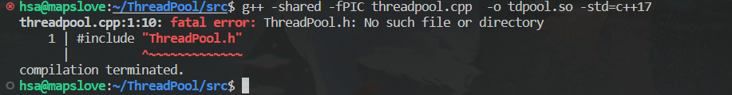
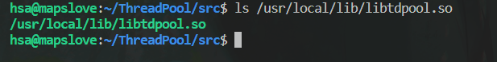
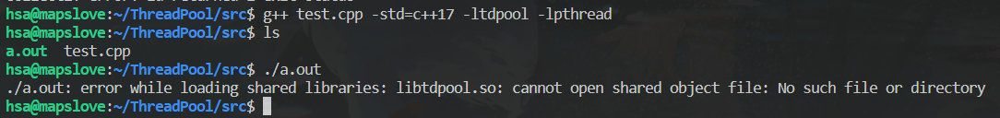

==为了保护我们的源代码不被泄露出去，可以将源代码编译为`.so`动态库(`linux`环境下)==

####将`ThreadPool.cpp` 编译为`libtdpool.so`库文件

>在C++中，您可以通过以下命令将一个`cpp`文件编译成共享库（.so文件）
>
>`g++ -shared -fPIC -o your_library.so your_source_file.cpp -std=c++11`
>
>解释一下这个命令：
>
>*   `g++`: 这是`GNU Compiler Collection`中的C++编译器。
>*   `-shared`: 这个选项告诉编译器生成一个共享库。
>*   `-fPIC`: ==这个选项告诉编译器生成位置独立的代码，这对于共享库是必要的==
>*   `-o your_library.so`: 这个选项指定生成的共享库的输出文件名。
>*   `your_source_file.cpp`: 这是您的C++源代码文件的文件名。
>*   `-std=c++11`：指定编译时的`C++`的标准
>
>请确保您已经安装了正确版本的g++，然后使用上述命令替换`your_library.so`和`your_source_file.cpp`为您实际的库名和源文件名。
>
>如果您的库依赖于其他库，您可能需要使用`-l`选项指定这些库，例如：	       
>
>`g++ -shared -fPIC -o your_library.so your_source_file.cpp -ldependency1 -ldependency2`
>
>其中`dependency1`和`dependency2`是您的库依赖的其他库的名字。
>
>请注意，对于特定的项目和平台，可能需要调整编译选项。

###在编译`Threadpool.cpp`的时候遇到的问题：

> 
>
> + 第一种解决方式：将`ThreadPool.h` 放到和`Threadpool.cpp`位于同一目录下编译
> + 第二种解决方式: 将`ThreadPool.h`放到系统的头文件的搜索路径`/usr/include` 或者`/usr/local/include` 下(不推荐)

### 将`libtdpool.so和ThreadPool.h` 放入到正确的搜索路径上

在==执行编译命令的时候==系统从以下路径查找`.a  .so  .h` 文件

> 在`/usr/lib `或`/usr/local/lib` 路径下查找`*.a`静态库文件 和`*.so`动态库文件 
>
> 在`/usr/include` 或`/usr/local/inlcude` 路径下查找`*.h` 头文件 

将`libtdpool.so` 放入正确的路径

> `su root `   
>
> `mv libtdpool.so /usr/local/lib/`

放入成功：

 

将`ThreadPool.h` 放入正确的路径下：

> `su root`
>
> `mv ThreadPool.h /usr/local/include/`

放入成功：

### 编译我们的测试文件

==`-l`跟的动态库的名字需要去头部的`lib`和尾部的`.so`==  

命令：

>  `g++ test.cpp -std=c++17 -ltdpool -lpthread `

解释：**`test.cpp` 依赖于`libtdpool.so` 和`libpthread.so` 两个动态库文件**

### 执行我们的测试文件

**不能直接执行** 

==注意，编译的时候寻找动态库的路径和运行时系统查找动态库的路径不同！== 【注：只需要设置一次就OK】

> Linux动态链接库的搜索路径按==优先级排序==为：
>
> + **动态库搜索路径顺序**
>
>   1.编译目标代码时指定的动态库搜索路径；
>
>   在编译时通过`gcc` 的参数”`-Wl,-rpath,`”指定。当指定多个动态库搜索路径时，路径之间用冒号”：”分隔。
>
>   2.环境变量`LD_LIBRARY_PATH`指定的动态库搜索路径；
>
>   3.配置文件`/etc/ld.so.conf`中指定的动态库搜索路径；
>
>   `/etc/ld.so.conf`的第一行有个引用命令：`include ld.so.conf.d/*.conf`
>
>   因此，==最优雅的方式是在`ld.so.conf.d`目录下创建一个你的程序依赖的配置文件，配置文件内容为程序依赖的动态链接库的路径，一个路径一行。==
>
>   添加完配置文件后执行`ldconfig`使其生效。
>
>   4.默认的动态库搜索路径`/lib`；
>
>   5.默认的动态库搜索路径`/usr/lib`；
>
> + **动态库路径设置方法**
>
>   1、可以用 `LD_LIBRARY_PATH`环境变量指定，这个类似于 `PATH` 机制，比较直观，而且，可以放到 `bashrc` 中固化下来，也可以放到自己的 `.bashrc` 中只对本用户起作用；
>
>   2、如果启用了 `ld.so.cache` 的话，系统会在 `/etc/ld.so.cache` 中存储所有可引用的动态链接库。这个文件的内容可以通过 `/etc/ld.so.conf` 来指定；这个是比较固定的机制，对全局所有用户都有影响；==不过更改设置后需要 `root` 调用 `ldconfig` 来刷新一下。==
>
>   3、默认的标准库路径，这个似乎不用设置就可以。包括` /lib` 和 `/usr/lib`。当然，如果是64位系统，还包括 `/lib64` 和 `/usr/lib64`。
>
>   4、其它情况，如果只想对某一个特定的应用程序起作用的话，可以在编译时指定搜索路径。`gcc` 的 `-Wl` 和 `-rpath` 参数。
>
>   奇怪的是， `/usr/local/lib` 和 `/usr/local/lib64` 居然不在标准路径之列。
>
>   > 例如 ： `g++ -shared -fPIC -o your_library.so your_source_file.cpp -Wl,-rpath,/path/to/your/library`
>   >
>   > - `-Wl`: 这个选项允许将逗号后面的参数传递给链接器（linker）。
>   > - `-rpath`: 这个参数告诉链接器在运行时搜索共享库时应该考虑的路径。

**选用第二种动态库设置方法需要执行的命令**：

> `su root`
>
> `cd /etc/ld.so.conf.d` 
>
> `vim mylib.conf`
>
> 在`mylib.conf` 中放入`/usr/local/lib`保存
>
> `ldconfig`                   // 将配置文件`ld.so.conf`中的路径重新刷新到`ld.so.cache` 中

执行命令编译文件：`g++ test.cpp -lpthread -ltdpool -std=c++17`

> 您提供的命令编译了一个名为`test.cpp`的C++源文件，并链接了两个库：`pthread`和`tdpool`，同时还指定了C++17的标准。
> 解释一下这个命令：
>
> 1.`g++`: 这是`GNU Compiler Collection（GCC）`中的C++编译器。
> 2.`test.cpp`: 这是您要编译的C++源文件的文件名。
> 3.`-lpthread`: 这个选项告诉编译器在链接时包含`pthread`库，这是用于多线程编程的`POSIX`线程库。
> 4.`-ltdpool`: 这个选项告诉编译器在链接时包含`tdpool`库，这似乎是您项目中使用的另一个库。
> 5.-std=c++17: 这个选项指定了C++的编译标准，这里是C++17。
>
> 您的源代码`（test.cpp）`将被编译并链接到这两个库，以生成可执行文件。如果编译和链接过程没有错误，您将在当前目录中看到一个可执行文件，其默认名称是`a.out`，或者您可以使用`-o`选项指定输出文件名。例如：
> `g++ test.cpp -o my_program -lpthread -ltdpool -std=c++17`
>
> 这将生成一个名为`my_program`的可执行文件，您可以运行它以执行您的C++程序。

**执行成功**

注：在执行`./a.out`可执行文件的时候，==之前已经设置好了路径，编译器会根据此路径寻找相应的动态链接库==，在使用到动态库的时候才其加载到内存

