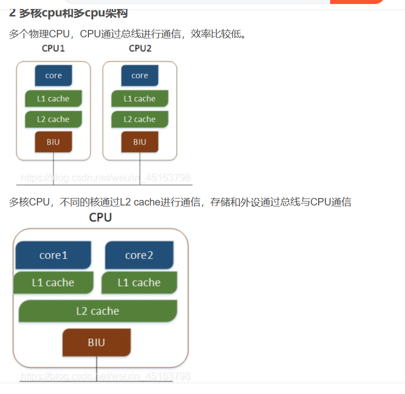

### 多线程的优势

***

多线程一定好吗？ 我们要看具体的应用场景：

 程序分为两种：

+ `IO`密集型
+ `CPU`密集型

> IO密集型（IO-bound）任务：指的是任务的**主要瓶颈是输入输出（IO）操作**，而不是计算操作。这种任务通常涉及大量的**文件读写、网络请求、数据库访问等IO操作**。在这种情况下，**CPU通常会处于等待IO完成的状态**，这个时候程序就被阻塞了，**因为IO操作相对较慢**。
>
> CPU密集型（CPU-bound）任务：指的是任务的**主要瓶颈是计算操作，而不是IO操作**。这种任务通常包括大规模的数据处理、复杂的算法计算、图像处理等需要大量CPU计算资源的操作。在这种情况下，CPU的计算能力成为任务的瓶颈，IO操作相对较快。

电脑为两种：

+ `CPU`单核
+ `CPU`多核、多CPU 

> 

一共有四种搭配情况，我们需要辨别的是每一种情况是否可以将**程序写为多核**的：

+ `IO ` 密集型程序在`多核，多CPU` 上：

  > 在此种情况下，我们将程序实现为`多线程`是合适的，假如有三个线程，当一个正在执行的线程因为`IO` 操作而被阻塞，操作系统会将其放入**阻塞队列**，不必像单线程一样等待其`IO` 操作，我们可以从**就绪队列中** 取出一个任务直接执行，从而提高了运行的效率。

+ `IO`密集型程序在`单核CPU` 上：

  > 也是合适的，程序是多线程的，当一个正在执行的线程因为`IO` 操作而被阻塞，操作系统会将其放入**阻塞队列**，不必像单线程一样等待其`IO` 操作，我们可以从**就绪队列中** 取出一个任务直接执行，从而提高了运行的效率。

+ `CPU`密集型程序在`多核，多CPU` 上：

  > 在此种情况下，我们将程序实现为`多线程`是比较好的 . 多个线程可以分配给多个处理单元分别进行处理，能够释放出`CPU`的硬件的计算能力。

+ `CPU`密集型程序在`单核CPU` 上：

  > ==不适合==，一个程序的计算量是定值，如果是单线程的话，就会一直执行，不会有什么额外的损耗，如果是`多线程`的话相当于将计算量分给多个线程，在**一个CPU** 上会来回切换线程。多线程会比单线程多一个**切换线程的开销** ， 所以：==如果是`CPU`密集型程序并且在`单核CPU`的情况下，我们最好还是将其设计为单线程的！==
  >
  > >线程调度的花费 ==线程的上下文切换==：当前线程调度完了，该调度下一个线程了。
  > >
  > >假设有三个线程`x, y , z`： 在`x`线程执行了一段时间之后，时间片到，切换到`y`线程 , 在切换之前，**先将CPU寄存器保存到`x`线程的栈上**【保存现场】 ， 将`y` 线程的栈上的`CPU` 信息恢复到`CPU` 寄存器中【恢复现场】，继续往下计算。
  > >
  > >线程调度的花费主要是**保存现场**和**恢复现场**

